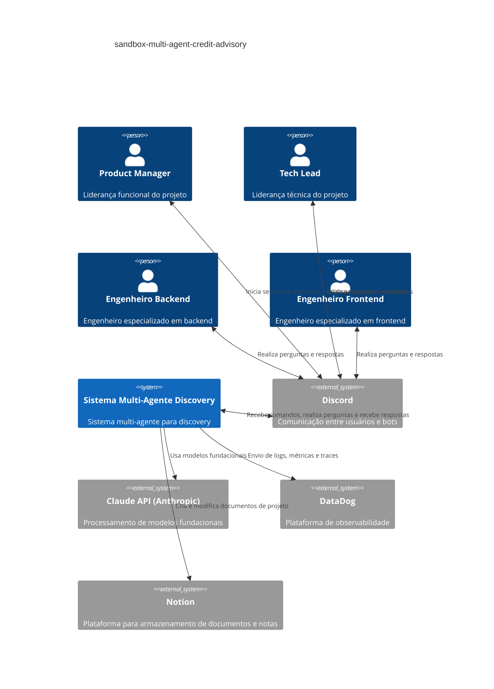

# Diagrama de contexto

Abaixo segue uma diagramação do contexto do projeto no nível 1 do C4 model:

```mermaid
C4Context
    title sandbox-multi-agent-credit-advisory

    Person(productmanager, "Product Manager", "Liderança funcional do projeto")
    Person(techlead, "Tech Lead", "Liderança técnica do projeto")
    Person(backend, "Engenheiro Backend", "Engenheiro especializado em backend")
    Person(frontend, "Engenheiro Frontend", "Engenheiro especializado em frontend")

    System(multiagent, "Sistema Multi-Agente Discovery", "Sistema multi-agente para discovery")

    System_Ext(discord, "Discord", "Comunicação entre usuários e bots")
    System_Ext(anthropic, "Claude API (Anthropic)", "Processamento de modelos fundacionais")
    System_Ext(datadog, "DataDog", "Plataforma de observabilidade")
    System_Ext(notion, "Notion", "Plataforma para armazenamento de documentos e notas")


    BiRel(productmanager, discord, "Inicia sessão de discovery, realiza perguntas e respostas")
    BiRel(techlead, discord, "Realiza perguntas e respostas")
    BiRel(backend, discord, "Realiza perguntas e respostas")
    BiRel(frontend, discord, "Realiza perguntas e respostas")
    BiRel(multiagent, discord, "Recebe comandos, realiza perguntas e recebe respostas")
    Rel(multiagent, anthropic, "Usa modelos fundacionais")
    Rel(multiagent, datadog, "Envio de logs, métricas e traces")
    Rel(multiagent, notion, "Cria e modifica documentos de projeto")

    UpdateLayoutConfig($c4ShapeInRow="3", $c4BoundaryInRow="1")
```
